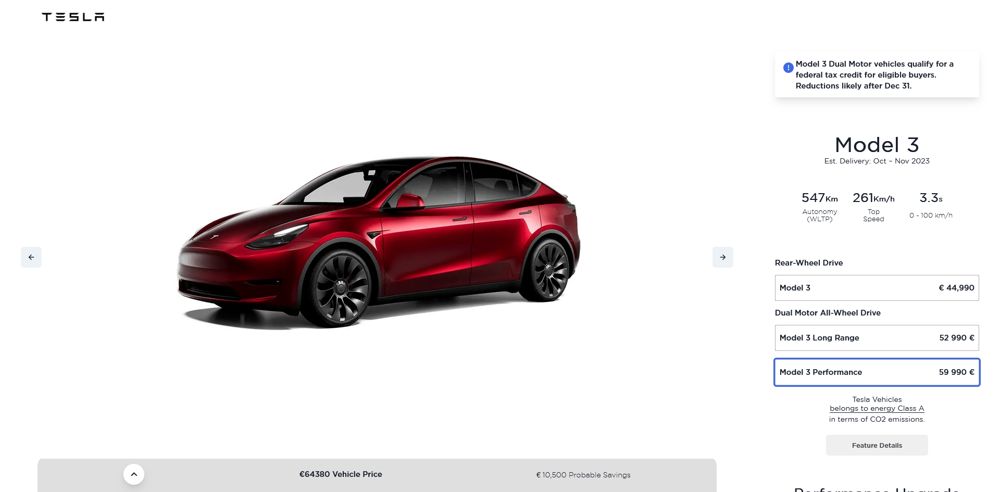
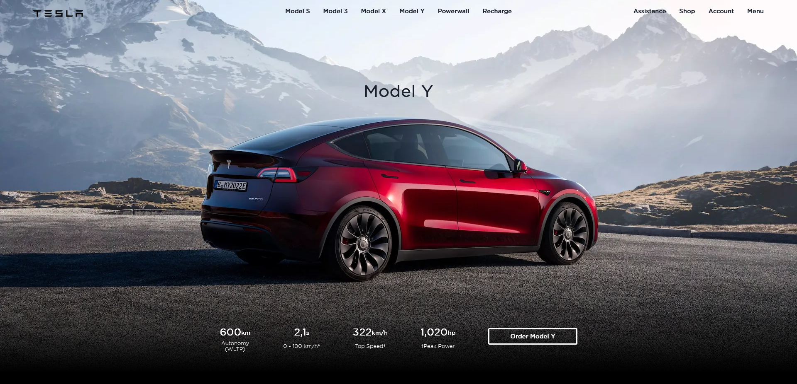

<p align="center">
      
</p>

<h1 align="center">🔆 Clone App 🔆</h1>

<div>
  <div>  
          
        
  </div>
</div>


# ✨ Features

- Implementation of the latest technlogies, such as  [`React.Js v18`](https://reactjs.org/), [`Next.Js v13`](https://nextjs.org/),
- Interactive 3D Configurator. Built with [`React Three Fiber`](https://docs.pmnd.rs/react-three-fiber/getting-started/introduction) & [`Three.Js`](https://threejs.org/) Library.
- All pages and animations are from the original Tesla Website
- SEO Optimizations
- Responsive design for optimal user experience

# ⚡ Spin Up

- Clone Repo :

```bash
git clone https://github.com/mateusloubach/tesla-clone.git
```

- ``` ↪️ cd tesla-clone ``` , then install dependencies:

```
npm install
```

- Launch App in Development Mode :

```
npm run dev
```
Open browser and navigate to ``` http://localhost:3000 ```. The App will automatically charge and be ready to use.

<br>

<h3 align="right">Thanks :heart:
    
Made by [Mateus Loubach](https://github.com/mateusloubach)
